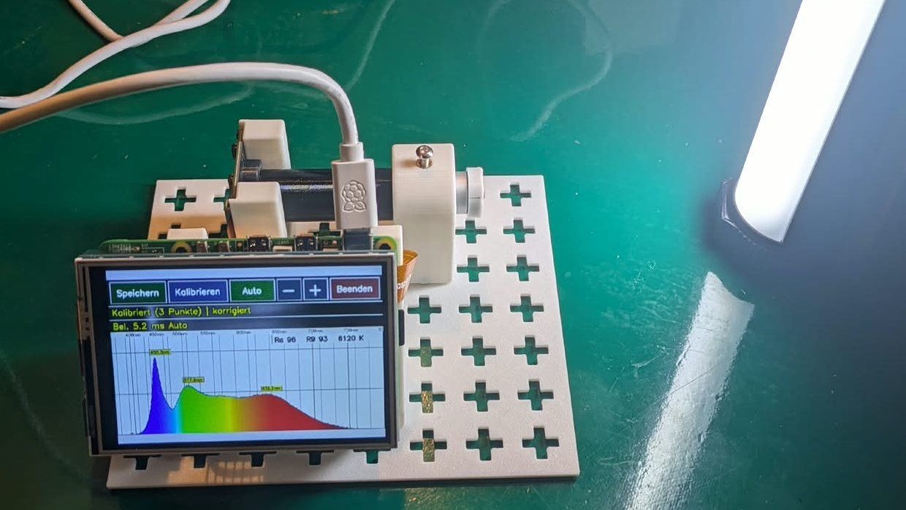

# Spektrometer für Leuchtmittel

Ein Demo-Spektrometer für den Unterricht, gebaut aus einem Raspberry Pi 5, einer Monochrom-Kamera ohne IR-Filter und einem Taschenspektroskop. Es zeigt das Spektrum von Glühlampe, Leuchtstofflampe und LEDs live auf einem Touchdisplay und auf dem Beamer und berechnet **Farbwiedergabeindex Ra, R9 und Farbtemperatur**.

Entstanden für den Lernfeld-Unterricht „Beleuchtungstechnik“ (Elektroniker/-in für Betriebstechnik): Lichtfarbe, Farbwiedergabe, Unterschied zwischen Kolorimeter und Spektralphotometer.



## Funktionen

- **Live-Spektrum 360–800 nm**, farbig dargestellt, mit den drei stärksten Maxima
- **Ra, R9 und Farbtemperatur** nach CIE 13.3 (über [colour-science](https://www.colour-science.org/)), als Schätzwert gekennzeichnet
- **Empfindlichkeitskorrektur** mit einer Glühlampe als Referenz (Planck-Strahler)
- **Kalibrier-Assistent** am Touchdisplay: Bildausschnitt, grüner Laser, roter Laser, blaue LED-Spitze, Glühlampe
- **Beamer-Ansicht** in Full HD: öffnet sich automatisch, sobald HDMI angesteckt wird
- Belichtung automatisch oder von Hand (0,1 ms bis 1 s), Speichern auf USB-Stick (PNG mit Datum und Maxima)
- Autostart, Bedienung komplett per Touch

## So funktioniert es

```
Lampe → Spaltkappe mit Streuscheibe → Taschenspektroskop (Prisma) → M12-Objektiv → Kamera OV9281 → Raspberry Pi 5
```

Die Streuscheibe vor dem Spalt sorgt dafür, dass Helligkeit und Lage des Spektrums nicht von der Lampenposition abhängen. Die Kamera fotografiert das Spektrum durch das Okular. Das Programm wertet die Kamerazeilen aus, ordnet jeder Spalte eine Wellenlänge zu und korrigiert die Empfindlichkeit des Aufbaus.

**Technische Besonderheiten:**
- Das Messprofil kommt aus den **Sensor-Rohdaten (10 Bit)**, nicht aus dem fertigen Kamerabild. Die Bildverarbeitung des Pi (Farbmatrix, Rauschfilter, Randabschattungs-Korrektur) ist bei schwachen Signalen stark nichtlinear.
- Über **60 Sensorzeilen** gemittelt, das senkt das Rauschen.
- Die Glühlampen-Referenz wird **zweimal belichtet** (kurz für Rot, lang für Blau) und zusammengesetzt, weil eine Glühlampe im Blauen nur wenige Prozent ihrer Rot-Intensität hat.
- **Ohne IR-Sperrfilter** reicht der Messbereich bis über 780 nm (mit Filter endet er bei ≈ 650 nm).

## Wie genau ist das?

Für Vergleiche im Unterricht gut geeignet, **kein Messgerät** im Sinne einer Prüfung.

| Lichtquelle | angezeigt |
|---|---|
| Glühlampe (Referenz) | Ra 97–99, R9 ≈ 94 |
| LED 5000 K | 4990 K, Ra 92, R9 62 (Abgleich auf diese Lampe) |
| LED 8500 K | ≈ 9700 K, Ra 97, R9 95 |

- Wellenlängenauflösung: einige Nanometer (Taschenspektroskop + Kamera)
- Die Wellenlängenachse stützt sich auf drei Punkte (532 nm, 650 nm, LED-Blauspitze ≈ 450 nm). Mit einer Linienquelle (Leuchtstoffröhre/Energiesparlampe: 436/546/611 nm) wäre sie genauer.
- Die Temperatur der Referenz-Glühlampe ist meist unbekannt. Sie wird im Assistenten eingestellt (Voreinstellung 2500 K, bestimmt durch Abgleich auf eine 5000-K-LED).

## Nachbauen

1. **Teile besorgen:** siehe [KAUFLISTE.md](KAUFLISTE.md)
2. **Drucken:** Grundplatte und Halter nach dem Raster-Grundplatten-System RGS, siehe [hardware/](hardware/)
3. **Raspberry Pi OS installieren** (64 Bit, mit Desktop, Trixie oder Bookworm), SSH/WLAN nach Bedarf
4. **Software installieren:**
   ```bash
   git clone https://github.com/kleiner009/spektrometer.git
   cd spektrometer
   ./install.sh
   sudo reboot
   ```
   Das Skript installiert die Pakete, legt `~/Spektrometer` mit einer Python-Umgebung an, trägt nach Rückfrage Kamera und Display in `/boot/firmware/config.txt` ein und richtet Autostart, Fensterregeln, Bildschirmprofile und eine Desktop-Verknüpfung ein.
5. **Touch kalibrieren** (falls nötig): `software/touch_kalibrierung.py` liefert die Matrix für `~/.config/labwc/rc.xml`
6. **Kalibrieren** (siehe unten)

## Kalibrieren

Taste **„Kalibrieren“** am Display. Der Assistent führt durch sechs Schritte:

1. **Bildausschnitt:** Weißes Licht vor den Spalt, der grüne Rahmen markiert das Spektrum, dann „Übernehmen“.
2. **Grüner Laser** (532 nm) und 3. **roter Laser** (650 nm): Laser auf die Streuscheibe richten, Belichtung anpassen, „Messen“.
4. **Blauer Punkt:** weiße LED, die Blauspitze wird gesucht (≈ 450 nm, einstellbar).
5. **Glühlampe:** 60–100 W ohne Dimmer, 15–20 cm Abstand. Die Belichtung wird für zwei Messungen automatisch gewählt. „Übereinstimmung lang/kurz“ sollte zwischen 0,8 und 1,25 liegen.
6. **Speichern:** Die alten Werte werden in `alt/` gesichert.

Danach die Achse auf den sinnvollen Bereich zuschneiden (die Glühlampe strahlt Infrarot bis über 850 nm, das sonst mit in den Ausschnitt fällt):

```bash
cd ~/Spektrometer && ./stop.sh && venv/bin/python3 zuschnitt.py && ./start.sh
```

## Bedienung

| Taste | Funktion |
|---|---|
| Speichern | PNG des Diagramms (mit Datum und Maxima) auf den USB-Stick |
| Kalibrieren | startet den Kalibrier-Assistenten |
| Auto/Manuell | automatische Belichtung an/aus |
| − / + | Belichtung in Stufen (0,1 ms … 1 s) |
| Beenden | Programm beenden |

Grau gezeichnete Kurventeile liegen außerhalb des kalibrierten Bereichs und gehen nicht in Ra/R9/Farbtemperatur ein.

## Ordner

```
software/   Programm (spektrometer.py, kamera.py, kalibrierung.py, beamer.py, …)
system/     Vorlagen: labwc-Fensterregeln/Touch, kanshi-Bildschirmprofile
hardware/   Druckdateien (3MF, Fusion 360 f3d) und RGS-Zeichnungen
install.sh  Installation auf dem Raspberry Pi
```

**Unterstützte Kameras:** OV9281 Mono (empfohlen) und OV5647 (Farbe; nur sinnvoll ohne IR-Sperrfilter in Objektiv *und* Halter). Das Modell wird automatisch erkannt (`kamera.py`, Tabelle `SENSOREN`).

## Sicherheit im Unterricht

- **Laser:** nur Laserklasse 1 oder 2 (< 1 mW), nie in Augen oder auf spiegelnde Flächen richten.
- **Glühlampe:** wird heiß; Abstand halten, Halter aus PETG (nicht PLA) drucken.

## Lizenz und Dank

Apache License 2.0, siehe [LICENSE](LICENSE) und [NOTICE](NOTICE).

Die Software baut auf **[PySpectrometer2](https://github.com/leswright1977/PySpectrometer2) von Les Wright** auf (Apache-2.0). Geänderte Dateien tragen einen Änderungshinweis im Kopf.

Projektseite: [johannes-roeding.de/spektrometer](https://johannes-roeding.de/spektrometer)

---

*Werbehinweis: Die Kaufliste enthält Amazon-Partnerlinks (mit \* markiert). Als Amazon-Partner verdiene ich an qualifizierten Verkäufen.*
